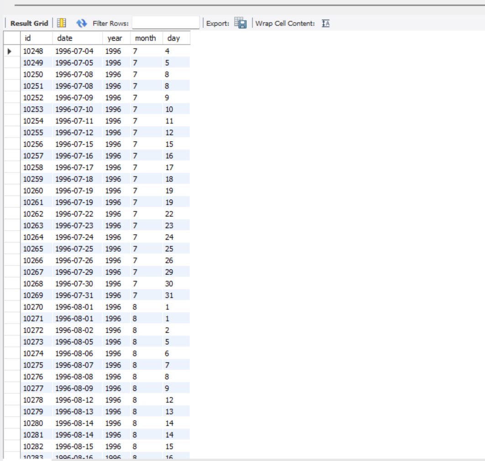
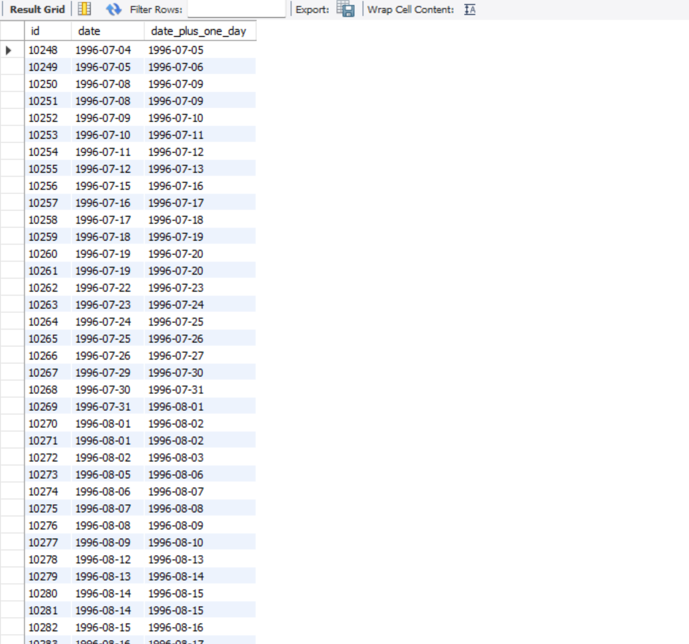
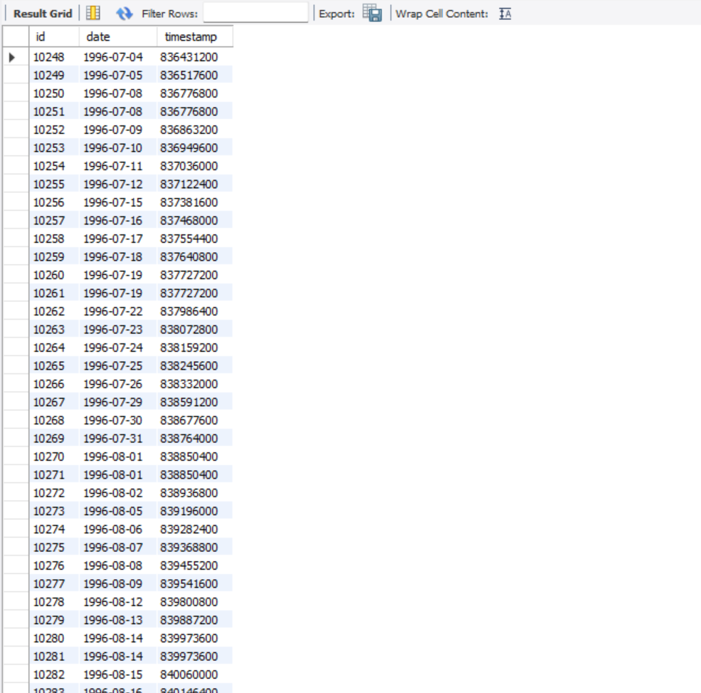
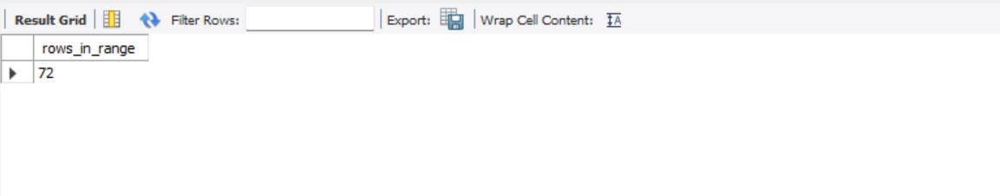
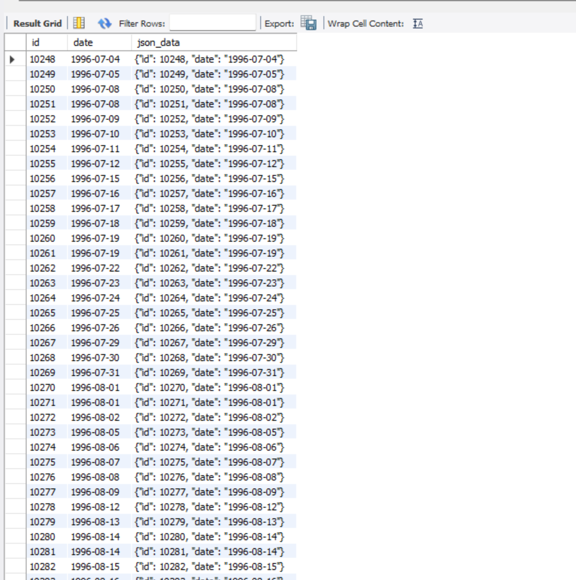

# woolf-rdb-hw-07

# Домашнє завдання №7 — Робота з часом та додаткові SQL-функції

## 📚 Опис

У цьому завданні реалізовано роботу з датами та JSON у SQL на базі `woolf-rdb-hw-03`. Поле `date` у таблиці `orders` має тип `TEXT`, тому застосовано функції `STR_TO_DATE`, `DATE_ADD`, `UNIX_TIMESTAMP`, `JSON_OBJECT` тощо.

---

## 📁 Структура проєкту

```
├── 01_extract_date_parts.sql
├── 02_add_one_day.sql
├── 03_convert_to_unix_timestamp.sql
├── 04_count_orders_in_date_range.sql
├── 05_json_object_from_order.sql
└── screenshots/
├── p1_extract_year_month_day.png
├── p2_add_one_day_to_date.png
├── p3_unix_timestamp.png
├── p4_count_orders_in_date_range.png
└── p5_json_object_from_order.png
```

---

## ✅ Завдання

### 🔹 1. Витяг року, місяця, числа з дати

- 📄 SQL-файл: [`01_extract_date_parts.sql`](./01_extract_date_parts.sql)  
- 🖼️ Скріншот:  
  

---

### 🔹 2. Додавання одного дня до дати

- 📄 SQL-файл: [`02_add_one_day.sql`](./02_add_one_day.sql)  
- 🖼️ Скріншот:  
  

---

### 🔹 3. Отримання UNIX timestamp

- 📄 SQL-файл: [`03_convert_to_unix_timestamp.sql`](./03_convert_to_unix_timestamp.sql)  
- 🖼️ Скріншот:  
  

---

### 🔹 4. Підрахунок рядків у діапазоні дат

- 📄 SQL-файл: [`04_count_orders_in_date_range.sql`](./04_count_orders_in_date_range.sql)  
- 🖼️ Скріншот:  
  

---

### 🔹 5. Формування JSON-об’єкта з полів `id` і `date`

- 📄 SQL-файл: [`05_json_object_from_order.sql`](./05_json_object_from_order.sql)  
- 🖼️ Скріншот:  
  

---

## 📝 Коментар

Усі запити виконуються в базі `woolf-rdb-hw-03`, результати задокументовані у скріншотах.  
Поле `date` має тип `TEXT`, тому перед використанням функцій було застосовано `STR_TO_DATE()`.

---
